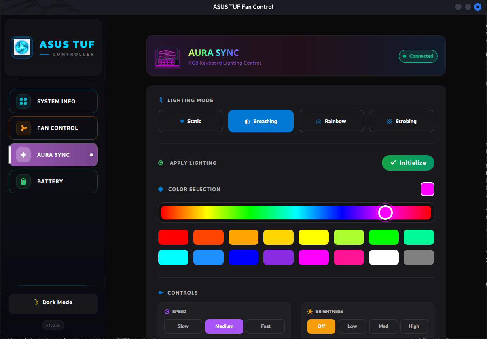
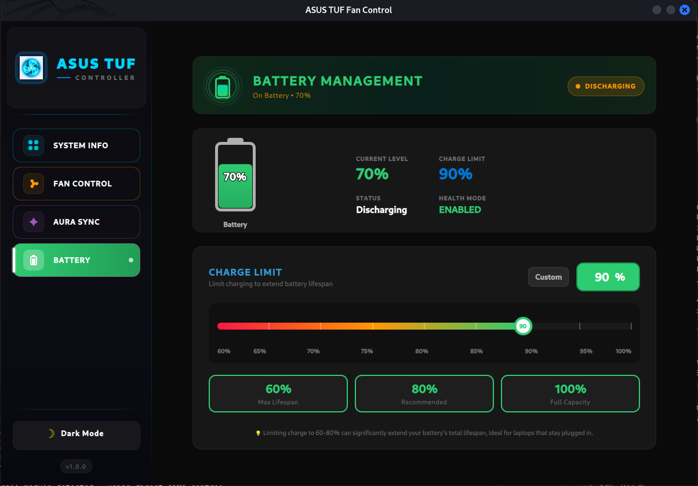

# 🎮 ASUS TUF Fan Control

<div align="center">


**A powerful system control utility for ASUS Gaming Laptops on Linux**

*Open-source alternative to Armoury Crate & G-Helper*

</div>

---

## 📸 Screenshots

<table>
  <tr>
    <td></td>
    <td></td>
  </tr>
  <tr>
    <td align="center"><b>System Dashboard</b></td>
    <td align="center"><b>Fan Control</b></td>
  </tr>
  <tr>
    <td></td>
    <td></td>
  </tr>
  <tr>
    <td align="center"><b>Aura Sync RGB</b></td>
    <td align="center"><b>Battery Management</b></td>
  </tr>
</table>

---

## ✨ Features

### 🌀 Fan Control
- Real-time RPM monitoring for CPU & GPU fans
- **Silent / Balanced / Turbo** performance modes
- Visual animated fan indicators
- Automatic thermal management via ACPI/WMI

### 🔋 Battery Health
- Charge limiting (60% / 80% / 100%) to extend battery lifespan
- Real-time charging status
- Persistent settings across reboots

### 💡 Aura Sync RGB
- Keyboard backlight control
- Multiple effects: Static, Breathing, Strobing, Rainbow
- Custom color picker
- Brightness adjustment

### 📊 System Dashboard
- CPU/GPU temperature & utilization
- Memory and disk usage
- Network activity monitoring
- MTP device detection (Android phones, cameras)

### 🎨 Premium UI
- Modern glassmorphic design
- Dark / Light mode support
- Responsive sidebar navigation
- Built with Qt6/QML

---

## �️ Supported Hardware

| Series | Models |
|--------|--------|
| **TUF Gaming** | F15, F17, A15, A17, Dash F15 |
| **ROG Strix** | G15, G17, Scar 15, Scar 17, G512, G513, G531, G713, G733 |
| **ROG Zephyrus** | G14, G15, M15, M16 |
| **ROG Flow** | X13, X16, Z13 |

### ✅ Tested Distributions
Ubuntu • Fedora • Arch Linux • Kali Linux • Manjaro • Pop!_OS

---

## 📋 Prerequisites

| Requirement | Details |
|-------------|---------|
| **OS** | Linux (Kernel 5.4+) |
| **Hardware** | ASUS TUF / ROG / Strix Gaming Laptop |
| **Modules** | `asus_wmi`, `asus_nb_wmi` (auto-loaded) |
| **Dependencies** | Qt6, CMake, GCC |

---

## 📥 Installation

### 1️⃣ Clone the Repository
```bash
git clone https://github.com/Karthigaiselvam-R-official/AsusTufFanControl_Linux.git
cd AsusTufFanControl_Linux
```

### 2️⃣ Run Setup Script
```bash
chmod +x setup.sh
sudo ./setup.sh
```
> This installs dependencies, builds `ec_probe`, configures polkit, and sets up desktop integration.

### 3️⃣ Build the Application
```bash
mkdir build && cd build
cmake ..
make -j$(nproc)
```

### 4️⃣ Install the Binary
```bash
sudo cp ./AsusTufFanControl_Linux /opt/asus-tuf-fan-control/
```

---

## ▶️ Running the Application

### 🖱️ Desktop (Recommended)
Launch **"ASUS TUF Fan Control"** from your Applications menu.
A password prompt will appear, then the app runs with elevated privileges.

### 💻 Terminal
```bash
sudo /opt/asus-tuf-fan-control/AsusTufFanControl_Linux
```

> **Note:** Root privileges are required for EC/ACPI hardware access.

---

## 🔧 How It Works

```
┌─────────────────────────────────────────────────────┐
│                    Application                       │
├─────────────────────────────────────────────────────┤
│  Qt6/QML UI  →  C++ Backend  →  Hardware Control    │
└─────────────────────────────────────────────────────┘
                         │
         ┌───────────────┼───────────────┐
         ▼               ▼               ▼
    ┌─────────┐    ┌──────────┐    ┌──────────┐
    │  ACPI   │    │   WMI    │    │    EC    │
    │  Call   │    │  Sysfs   │    │  Probe   │
    └─────────┘    └──────────┘    └──────────┘
         │               │               │
         └───────────────┴───────────────┘
                         │
                   Hardware Layer
            (Fans, Battery, RGB, Sensors)
```

**Fallback Chain:** ACPI → WMI Thermal Policy → WMI PWM → EC Probe

---

## ⚠️ Disclaimer

> **Use at your own risk.**

This tool manipulates low-level system hardware (Embedded Controller and ACPI methods).

- Improper fan settings could lead to overheating
- The authors are not responsible for any hardware damage
- Always monitor temperatures when adjusting fan curves

---

## 🤝 Contributing

Contributions are welcome!

1. Fork the project
2. Create your feature branch: `git checkout -b feature/AmazingFeature`
3. Commit your changes: `git commit -m 'Add some AmazingFeature'`
4. Push to the branch: `git push origin feature/AmazingFeature`
5. Open a Pull Request

---

## 👤 Author

**Karthigaiselvam R**

[](mailto:karthigaiselvamr.cs2022@gmail.com)
[](https://www.linkedin.com/in/karthigaiselvam-r-7b9197258/)

---

## 📄 License

**Source Available License:** Commons Clause + GNU General Public License v3.0

| ✅ Allowed | 🚫 Not Allowed |
|------------|----------------|
| Use freely | Sell the software |
| Modify code | Commercial services |
| Share code | Paid distribution |

See [LICENSE](LICENSE) for full text.

---

<div align="center">

**If you find this project useful, please ⭐ star the repository!**

Made with ❤️ for the ASUS Linux Community

</div>
